# Vite React H5 Template

一个面向移动端 H5 的 React 项目模板，基于 Vite、TypeScript 和 Tailwind CSS。项目内置多环境构建、多语言路由、统一 API 请求层、全局状态、错误边界、通知组件，以及微信和 Telegram WebView 的基础适配能力。

## 技术栈

- React 19、React Router 8、TypeScript 6、Vite 8
- Tailwind CSS 4、Fontsource Variable Fonts、SVG Sprite 与 SVGR
- i18next、react-i18next
- Zustand、Immer、持久化中间件
- Axios 统一请求层
- Oxlint、类型感知规则、Prettier、Husky、lint-staged

## 快速开始

```bash
pnpm install
pnpm dev
```

开发服务器默认运行在 [http://localhost:8888](http://localhost:8888)。如果端口已被占用，Vite 会自动选择其他端口。

常用命令：

| 命令                | 用途                         |
| ------------------- | ---------------------------- |
| `pnpm dev`          | 启动开发环境                 |
| `pnpm dev:brand`    | 选择品牌并启动本地开发环境   |
| `pnpm build:qa`     | 类型检查并构建 QA 版本       |
| `pnpm build:prod`   | 类型检查并构建生产版本       |
| `pnpm preview`      | 预览构建产物                 |
| `pnpm lint`         | 运行 Oxlint                  |
| `pnpm lint:ci`      | 将所有 lint warning 视为失败 |
| `pnpm lint:fix`     | 自动修复可修复的 lint 问题   |
| `pnpm format`       | 使用 Prettier 格式化项目     |
| `pnpm format:check` | 检查代码格式                 |
| `pnpm gen-svg`      | 生成 Sprite、SVGR 和图标类型 |
| `pnpm i18n`         | 从 Excel 生成多语言 JSON     |
| `pnpm i18n:lark`    | 运行飞书多语言同步脚本       |

### 多品牌本地开发

本地开发使用 `dev:brand` 选择品牌。脚本会从 `config/brands.ts` 读取品牌配置，并将选中的值注入 Vite：

- `VITE_BRAND`：品牌配置的 key。
- `VITE_APP_ID`：当前品牌的 App ID。
- `VITE_API_BASE_URL`：当前品牌的 API 基础地址。

交互式选择品牌：

```bash
pnpm dev:brand
```

也可以直接传入品牌 key，跳过选择：

```bash
pnpm dev:brand afun
pnpm dev:brand bfun
```

品牌配置示例：

```ts
// config/brands.ts
export type BrandConfig = {
  label: string;
  appId: string;
  apiBaseUrl: string;
};

export const brands: Record<string, BrandConfig> = {
  afun: {
    label: 'Afun',
    appId: '12001',
    apiBaseUrl: 'https://api-afun.example.com',
  },
};
```

新增品牌时，在 `brands` 对象中增加一个唯一的 key，并填写 `label`、`appId` 和 `apiBaseUrl`。建议 key 使用简短、稳定、只包含小写字母、数字和连字符的名称，便于命令行输入。

`config/brands.ts` 只用于本地开发品牌选择。测试服、体验服和正式服构建时，应由 CI/CD 注入对应的 `VITE_APP_ID` 和 `VITE_API_BASE_URL`，不要把正式环境配置写进本地启动脚本。

## 目录结构

```text
config/
└── brands.ts            # 本地开发品牌配置和类型

src/
├── api/                  # 请求客户端、鉴权会话、错误归一化和业务接口
├── assets/
│   └── svg/              # SVG source、生成组件、Sprite 和图标类型
├── components/
│   ├── features/         # 带业务或应用语义的组件
│   └── ui/               # 通用 UI 组件，包括统一 Icon 入口
├── constants/            # 全局常量
├── i18n/                 # 语言资源、路由本地化和导航工具
├── layout/               # 页面公共布局
├── libs/                 # 设备判断、样式工具和可选平台适配代码
├── pages/                # 路由页面
├── routes/               # 业务路径常量与 React Router 配置
├── store/                # Zustand 全局状态
├── types/                # 全局类型声明
├── index.css             # Tailwind 入口和全局样式
└── main.tsx              # 应用启动入口

scripts/                  # SVG、Excel、飞书等工程脚本
public/                   # 原样发布的静态资源、生成的 Sprite 和预览页
```

项目使用 `@/*` 映射到 `src/*`。页面组件放在 `pages`，跨页面业务组件放在 `components/features`，可复用的纯 UI 放在 `components/ui`。

## 字体约定

项目字体使用 Fontsource variable font 接入，由 Vite 在构建时处理字体资源，不需要手动下载 Google Fonts 文件到本地。

- `src/main.tsx` 统一引入字体 CSS：`@fontsource-variable/inter/wght.css` 和 `@fontsource-variable/albert-sans/wght.css`。
- `src/index.css` 通过 Tailwind CSS 4 的 `@theme` 定义字体 token。
- 全项目默认字体是 Inter：`body` 使用 `font-family: var(--font-sans)`。
- Albert Sans 作为局部字体使用，Tailwind 类名为 `font-albert-sans`。
- 字重继续使用 Tailwind 原子类，例如 `font-normal`、`font-medium`、`font-semibold`、`font-bold`。

示例：

```tsx
<h1 className="font-albert-sans font-semibold">Title</h1>
```

后续如果新增开源英文字体，优先使用 `@fontsource-variable/<font-name>`，在 `src/main.tsx` 引入对应 `wght.css`，再在 `src/index.css` 的 `@theme` 中补充 `--font-*` token。只有私有字体或商用字体才建议放到 `public/fonts` 并手写 `@font-face`，且优先使用 `woff2`。

## SVG 与 Icon

业务代码统一使用 `@/components/ui/Icon`，本地 Sprite、本地 SVGR、HTTP(S) SVG 和普通远程图片都通过 `name` 传入，不再直接导入 SVG 文件。

```tsx
import Icon from '@/components/ui/Icon';

export function IconExamples() {
  return (
    <div className="flex items-center gap-3">
      <Icon name="tabbar_home" className="size-6" color="#dc2626" />
      <Icon name="adult" className="size-9" />
      <Icon
        name="https://video.qg5k.com/10210/188c4c688264452c8439c99b56b6ce14.svg"
        className="size-6"
      />
    </div>
  );
}
```

图标源文件和生成结果按用途分开维护：

```text
src/assets/svg/
├── source/
│   ├── sprites/              # 单色小图标，使用 currentColor 着色
│   ├── svgrs/                # 多色、渐变或需要手动维护主题变量的图标
│   └── configurable-icons/   # 提供给后台配置端的图标，不参与生成
└── generated/                # 自动生成的 TSX、Sprite、类型和注册表
```

新增、删除图标后执行 `pnpm gen-svg`。`pnpm dev`、`pnpm build:qa` 和 `pnpm build:prod` 也会在启动或构建前自动生成。应用启动时由 `src/main.tsx` 注入 inline Sprite，生成文件不要手动修改，但 SVGR TSX 除外。

SVGR 使用增量维护规则：source 存在且 TSX 不存在时才生成；已经生成的 TSX 不会被脚本覆盖，可以手动接入 CSS 变量和主题逻辑。需要根据新 source 重建时，先删除对应的 generated TSX；删除 source 后，脚本也会删除对应的孤立 TSX。

远程 `.svg` 未传 `color` 时使用 `img`，传入 `color` 时使用 CSS mask 着色；其他远程图片使用 `img`。后台返回普通字符串时，先使用 `isIconName` 做运行时校验：

```tsx
import Icon from '@/components/ui/Icon';
import { isIconName } from '@/components/ui/Icon/icon-name';

const configuredIcon: string = response.icon;

return isIconName(configuredIcon) ? <Icon name={configuredIcon} className="size-6" /> : null;
```

Sprite 图标预览页会生成到 `public/sprite-preview.html`，首页的 Internationalization 下方也提供了 Sprite、SVGR 和远程图标的混合渲染示例。完整维护规则见 [`src/assets/svg/README.md`](src/assets/svg/README.md)。

## 应用启动流程

`main.tsx` 先初始化调试工具、App Scheme、i18next 和 Router，再按以下层级挂载应用：

```text
StrictMode
├── SpriteSvgSource
└── AppErrorBoundary
    └── I18nextProvider
        └── NotificationProvider
            └── MessageProvider
                └── DialogProvider
                    ├── ApiErrorReporter
                    └── AppEnvGuard
                        └── AppStartup
                            └── AppRoutes
```

- `SpriteSvgSource` 将生成的本地 Sprite 注入页面，供 `Icon` 通过 `<use>` 使用。
- `AppErrorBoundary` 提供应用级异常兜底。
- `NotificationProvider`、`MessageProvider` 和 `DialogProvider` 提供全局反馈能力。
- `ApiErrorReporter` 将 API 层抛出的非 401 错误接入 notification 或 Dialog Tips。
- `AppEnvGuard` 根据 `VITE_APP_SOURCE` 校验运行来源，并通过 Context 向启动流程提供只检测一次的运行环境。
- `AppStartup` 统一协调平台授权、公共初始化、启动错误重试和业务路由挂载。
- 非生产环境会启用 vConsole，方便移动端调试。

### 构建来源与运行环境

`VITE_APP_SOURCE` 是构建时限制，`getDeviceEnvironment()` 返回的是实际运行环境，两者不能混为一谈：

- `VITE_APP_SOURCE=telegram`：只允许在 Telegram 中运行，其他环境由 `AppEnvGuard` 阻止。
- `VITE_APP_SOURCE=wechat`：只允许在微信中运行。
- `VITE_APP_SOURCE=universal`：允许多种环境，但仍会根据实际环境选择 Telegram、微信或通用启动流程。

例如，通用构建在 Telegram 中打开时仍然执行 Telegram 登录，而不是直接跳过平台授权。

### 启动状态与执行顺序

`AppStartup` 维护 `platform-auth`、`initialization`、`ready` 和 `error` 状态，正常流程如下：

```mermaid
flowchart TD
  A["AppEnvGuard 校验运行环境"] -->|不匹配| B["环境错误页"]
  A -->|匹配| C{"实际运行环境"}
  C -->|Telegram| D["读取 initData 并登录"]
  C -->|微信| E["微信静默授权（当前预留）"]
  C -->|浏览器或其他通用环境| F["跳过平台授权"]
  D --> G["执行公共初始化任务"]
  E --> G
  F --> G
  G -->|成功| H["挂载 AppRoutes"]
  D -->|失败| I["授权错误页"]
  E -->|失败| I
  G -->|失败| J["初始化错误页"]
```



Telegram 环境首先显示“正在通过 Telegram 登录”，登录完成后只把文案更新为“正在初始化应用”。两个阶段始终由同一个 `StartupLoadingScreen` 实例渲染，Logo、Spinner 和布局不会因为阶段变化而卸载重建；全部完成后才将启动页替换为 `AppRoutes`。

重试遵循失败阶段：

- 平台授权失败时，从对应平台授权重新开始。
- 公共初始化失败时，只重新执行公共初始化，不重复 Telegram 登录。
- 每次启动运行都会创建 `AbortController`；组件卸载或开始新一轮运行时会向旧流程发出取消信号，并阻止过期任务更新界面。具体接口应继续接收该 `signal`，以便真正中止网络请求。

启动模块集中维护在：

```text
src/components/features/AppStartup/
├── platforms/
│   ├── telegram.ts            # Telegram ready、initData 和登录逻辑
│   └── wechat.ts              # 微信静默授权预留入口
├── index.tsx                  # 启动状态机、文案、错误和重试
├── initialize.ts             # 授权后的跨平台公共初始化
└── StartupLoadingScreen.tsx  # 启动阶段共用且保持挂载的画面
```

### 维护平台授权

平台模块只负责异步授权和写入登录态，不负责渲染启动页面：

- `platforms/telegram.ts` 调用 `Telegram.WebApp.ready()` 并读取 `initData`。当前保留了模拟登录耗时；接入真实接口后应删除模拟等待，调用 `telegramAuthApi.loginOnce()` 并保存后端返回的 Token。
- `platforms/wechat.ts` 当前立即完成，仅作为静默授权入口。后续应在返回的 Promise 完成前取得授权结果并写入登录态。

平台函数抛出错误时，`AppStartup` 会进入授权错误状态；正常返回后才会继续执行公共初始化。客户端环境判断只用于选择流程，Telegram `initData` 和微信授权参数仍必须由后端验证。

### 维护公共初始化

依赖登录态的全局接口统一加入 `AppStartup/initialize.ts` 中的 `appInitializers`。所有 initializer 接收当前运行环境和 `AbortSignal`，默认通过 `Promise.all()` 并行执行；存在先后依赖的步骤应封装在同一个 initializer 内串行完成。

典型任务包括：

- 获取当前用户和权限；
- 加载全局配置、功能开关或基础字典；
- 将接口结果写入 Zustand Store 或其他全局缓存。

普通接口默认返回 `{ code, data, message }` 时，统一请求层会完成校验和解包，initializer 直接拿到 `data`。例如：

```ts
import { request } from '@/api';
import { useGlobalStore } from '@/store/useGlobalStore';

interface GlobalConfig {
  featureEnabled: boolean;
  serviceName: string;
}

async function initializeGlobalConfig({ signal }: AppInitializationContext) {
  const config = await request<GlobalConfig>({
    method: 'GET',
    signal,
    url: '/api/global-config',
  });

  if (signal.aborted) return;
  useGlobalStore.getState().setGlobalConfig(config);
}

const appInitializers: AppInitializer[] = [initializeGlobalConfig];
```

上例假设 Store 已提供 `setGlobalConfig()`。初始化结果应写入全局状态，不要只保存在启动组件的局部 state 中，否则业务页面挂载后无法复用。若某个任务不是进入应用的必要条件，应在任务内部自行降级处理；initializer 向外抛错会阻止 `AppRoutes` 挂载并显示初始化重试页。

## 路由与国际化

业务路径统一定义在 `src/routes/paths.ts`，React Router 路由树定义在 `src/routes/index.tsx`，并由语言前缀驱动。目前支持：

| 语言               | URL 前缀 |
| ------------------ | -------- |
| English (`en-US`)  | 无前缀   |
| 简体中文 (`zh-CN`) | `/zh`    |
| Español (`es`)     | `/es`    |
| Português (`pt`)   | `/pt`    |

语言配置位于 `src/i18n/config.ts`，翻译资源位于 `src/i18n/locales`。每种语言共享同一组页面路由，整体结构如下：

```text
LocaleLayout                    # 切换语言、提供页面转场容器
├── RootLayout                  # Tab 页面公共布局
│   ├── TabTransitionOutlet     # 渲染当前 Tab 页面
│   └── AppTabBar               # 底部导航栏
├── apply                       # 普通二级页，不显示 TabBar
├── goods/:id                   # 带动态参数的普通二级页
└── *                           # 404 页面
```

Tab 页面使用 `transitionSurface: 'tab'`，切换时不产生页面入栈效果；普通二级页使用 `transitionSurface: 'stack'`，按页面栈方式转场。

`ROUTE_PATHS` 保存不带语言前缀的应用内绝对路径和动态路径模式，是 Router、TabBar 和站内链接的唯一业务路径来源。`TAB_ROUTE_PATHS` 和 `PAGE_ROUTE_PATHS` 只用于按页面类型组织路径；业务代码通常直接使用合并后的 `ROUTE_PATHS`。语言前缀继续由 `LocalizedLink`、`LocalizedNavLink` 和 `useLocalizedNavigate` 自动处理，不应写入路径常量。

`*` 这类兜底匹配规则和按语言配置生成的父路由不是业务跳转目标，分别保留在 `src/routes/index.tsx` 和 `src/i18n/config.ts`，不放入 `ROUTE_PATHS`。

React Router 的嵌套子路由需要相对 `path`，使用 `toChildPath(ROUTE_PATHS.Xxx)` 从 canonical 绝对路径转换。首页 `/` 始终使用 `index: true`，类型上也不允许将它传给 `toChildPath`。

### 添加普通页面

1. 在 `src/pages/<PageName>/index.tsx` 创建并默认导出页面组件。
2. 在 `src/routes/paths.ts` 的 `PAGE_ROUTE_PATHS` 中添加 canonical 绝对路径。
3. 在 `src/routes/index.tsx` 引入页面，并用 `toChildPath(ROUTE_PATHS.Xxx)` 将路由添加到对应的 `children` 中。
4. 非首屏页面可以通过 `lazy` 按需加载；使用 `lazy` 时，页面会由现有转场出口内的 `Suspense` 处理加载状态。

### 添加 Tab 页

Tab 页会显示底部导航栏，需要同时修改路由和 TabBar：

1. 将 canonical 绝对路径加入 `src/routes/paths.ts` 的 `TAB_ROUTE_PATHS`。
2. 将页面路由加入 `createPageRoutes()`，并设置 `handle: tabTransitionHandle`。
3. 在 `src/components/features/AppTabBar/index.tsx` 的 `tabs` 中引用对应的 `ROUTE_PATHS` 成员，并添加标题和图标。
4. TabBar 继续使用 `LocalizedNavLink`，不要手动拼接语言前缀。

```tsx
// src/routes/index.tsx
{ path: toChildPath(ROUTE_PATHS.Orders), element: <Orders />, handle: tabTransitionHandle }

// src/components/features/AppTabBar/index.tsx
{ path: ROUTE_PATHS.Orders, text: 'Orders', icon: 'orders' }
```

首页是 `createPageRoutes()` 中的 `index: true` 路由，对应 TabBar 的 `/`。

### 添加普通二级页

普通二级页不应放入 `RootLayout`，而应作为它的同级路由直接添加到 `LocaleLayout` 的 `children`，这样页面不会显示底部 TabBar：

```tsx
{
  path: toChildPath(ROUTE_PATHS.OrderDetail),
  element: <OrderDetail />,
  handle: stackTransitionHandle,
}
```

页面可以通过 `useParams()` 读取动态参数，并使用 `SecondaryHeader` 提供统一的返回栏。若页面需要从任意入口打开，使用 `LocalizedLink` 或 `useLocalizedNavigate`：

```tsx
<LocalizedLink to={generatePath(ROUTE_PATHS.OrderDetail, { id: String(order.id) })}>
  查看订单
</LocalizedLink>;

const navigate = useLocalizedNavigate();
navigate(generatePath(ROUTE_PATHS.OrderDetail, { id: String(order.id) }));
```

站内跳转应优先使用 `LocalizedLink`、`LocalizedNavLink` 和 `useLocalizedNavigate`，避免丢失当前语言前缀。只有返回上一页这类历史记录操作需要直接使用 React Router 的 `navigate(-1)`。

## API 与状态管理

`src/api/client.ts` 封装了 Axios，并统一处理：

- API Base URL、超时和公共请求上下文
- Token 注入与未授权会话失效
- `{ code, data, message }` 业务响应解包
- 网络错误和业务错误归一化
- 非 401 API 错误的全局展示分发
- Blob 文件下载与文件名解析

业务接口按领域放在 `src/api/modules`，再由 `src/api/index.ts` 统一导出。全局客户端状态使用 Zustand，示例 Store 已集成 Immer 和本地持久化。

### 业务接口类型组织

业务接口类型按模块维护，不集中堆到 `src/api/types.ts`。`src/api/types.ts` 只放请求层通用类型，例如 `ApiResponse`、`ApiRequestConfig`、分页结构等。

推荐每个业务模块使用目录结构：

```text
src/api/modules/product/
├── index.ts      # 接口函数
└── types.ts      # Product 模型、ProductListReq、ProductListRes 等业务类型
```

命名建议：

- 实体模型使用业务名：`Product`、`User`、`Order`。
- 请求/响应类型带接口动作：`ProductListReq`、`ProductListRes`、`ProductDetailReq`、`ProductDetailRes`。
- `Res` 表示 `request()` 解包后的真实业务数据，不包含 `{ code, data, message }` 外壳。

示例：

```ts
// src/api/modules/product/types.ts
export interface ProductListReq {
  limit?: number;
  select?: string;
  skip?: number;
}

export interface ProductListRes {
  limit: number;
  products: Product[];
  skip: number;
  total: number;
}
```

```ts
// src/api/modules/product/index.ts
export function list(params?: ProductListReq, signal?: AbortSignal) {
  return request<ProductListRes>({
    params,
    url: PRODUCT_API_URL,
  });
}
```

### API 错误展示约定

普通业务接口默认返回 `{ code, data, message }`。当 `code !== 200` 时，请求层会抛出 `ApiError`，并在继续向调用方 `throw` 之前触发全局错误展示。401 仍由 `authSession.expire()` 处理，不走普通 notification。

默认展示规则：

- 有业务错误码时，优先查找 `message.error_${code}`。
- 展示内容保留错误码，格式为 `[code] - translated message`。
- 如果没有业务错误码，则使用 HTTP 状态码或 `UNKNOWN` 作为展示码。
- 网络失败、超时和未知错误使用 `message.error_network`、`message.error_timeout`、`message.error_unknown` 兜底。

例如后端返回：

```json
{
  "code": 1201,
  "data": null,
  "message": "Login failed"
}
```

如果语言文件中存在：

```json
{
  "message": {
    "error_1201": "Login failed. Please try again later."
  }
}
```

则 notification 内容为：

```text
[1201] - Login failed. Please try again later.
```

带变量的错误码优先要求后端 `data` 字段和翻译变量名保持一致：

```json
{
  "code": 1203,
  "data": {
    "time": 10
  },
  "message": "Please wait"
}
```

```json
{
  "message": {
    "error_1203": "Please wait {{time}} minutes before trying again."
  }
}
```

如果历史接口字段名无法对齐，或需要把秒转换成分钟等格式化逻辑，在 `src/components/features/ApiErrorReporter/error-rules.ts` 的 `ERROR_MESSAGE_VALUE_RESOLVERS` 中为对应错误码补 resolver。

少数错误码需要用户确认、跳转或执行后续动作时，在 `ERROR_TIPS_RULES` 中配置为 Dialog Tips；其他错误码保持默认 notification 即可。

调用方需要完全自己处理错误时，在请求配置中传 `errorHandling: 'manual'`。此时请求仍会抛出 `ApiError`，但不会触发全局 notification/Tips：

```ts
await request<LoginResult, LoginParams>({
  data,
  errorHandling: 'manual',
  method: 'POST',
  url: '/api/login',
});
```

## 环境变量

Vite mode 表示部署环境，品牌通过 `VITE_BRAND`、`VITE_APP_ID` 和 `VITE_API_BASE_URL` 表示。项目分别使用 `.env.development`、`.env.qa` 和 `.env.production`：

| 变量                    | 说明                                          |
| ----------------------- | --------------------------------------------- |
| `VITE_APP_ENV`          | 当前环境：`development`、`qa` 或 `production` |
| `VITE_BRAND`            | 当前品牌 key，可选                            |
| `VITE_APP_ID`           | 当前品牌 App ID                               |
| `VITE_API_BASE_URL`     | API 基础地址                                  |
| `VITE_APP_APPID_WEIXIN` | 微信 App ID                                   |
| `VITE_APP_APPID_ALIPAY` | 支付宝 App ID                                 |
| `VITE_APP_BASE`         | 二级目录部署前缀，可选                        |
| `VITE_OUT_DIR`          | 构建输出目录，可选                            |
| `VITE_APP_SOURCE`       | 运行来源：`universal`、`wechat` 或 `telegram` |

本地执行 `pnpm dev:brand` 时，脚本会覆盖当前进程中的 `VITE_BRAND`、`VITE_APP_ID` 和 `VITE_API_BASE_URL`。直接执行 `pnpm dev` 时，变量来自 `.env.development` 或 `.env.development.local`。

测试和生产构建时，可以由 CI/CD 注入品牌配置：

```bash
VITE_BRAND=afun \
VITE_APP_ID=12001 \
VITE_API_BASE_URL=https://api-afun.example.com \
pnpm build:prod
```

### 部署时注入环境变量

这是一个 SPA，`VITE_*` 环境变量会在 `vite build` 时写入前端静态资源。部署流程应先注入变量并完成构建，再将生成的 `dist` 部署到 Nginx、对象存储或 Docker 镜像中：

```bash
# 测试环境
VITE_APP_ENV=qa \
VITE_BRAND=afun \
VITE_APP_ID="$AFUN_QA_APP_ID" \
VITE_API_BASE_URL="$AFUN_QA_API_BASE_URL" \
pnpm build:qa

# 正式环境
VITE_APP_ENV=production \
VITE_BRAND=afun \
VITE_APP_ID="$AFUN_PROD_APP_ID" \
VITE_API_BASE_URL="$AFUN_PROD_API_BASE_URL" \
pnpm build:prod
```

推荐在 CI/CD 中按“品牌 + 部署环境”维护变量组，例如 `afun/qa`、`afun/production`。构建任务从对应变量组读取 `APP_ID` 和 `API_BASE_URL`，再映射为前端需要的 `VITE_APP_ID` 和 `VITE_API_BASE_URL`。正式环境不要依赖开发机上的 `.env` 文件，也不要把正式配置写入 `config/brands.ts`。

如果 Dockerfile 负责执行前端构建，需要在 `docker build` 阶段传入参数：

```bash
docker build \
  --build-arg VITE_APP_ID="$AFUN_PROD_APP_ID" \
  --build-arg VITE_API_BASE_URL="$AFUN_PROD_API_BASE_URL" \
  -t web-afun:production .
```

Dockerfile 需要在构建阶段声明并转成环境变量：

```dockerfile
ARG VITE_APP_ID
ARG VITE_API_BASE_URL
ENV VITE_APP_ID=$VITE_APP_ID
ENV VITE_API_BASE_URL=$VITE_API_BASE_URL
RUN pnpm build:prod
```

如果 Docker 镜像只负责发布已经构建好的 `dist`，则应在 `docker build` 之前完成上述构建。此时执行 `docker run -e VITE_APP_ID=...` 不会修改已经打包好的前端代码；若需要容器启动后动态切换品牌，应另行实现运行时配置文件方案。

`VITE_*` 变量会暴露给浏览器，只能存放品牌标识、API 地址等公开配置，不能存放 API 密钥、数据库密码或其他敏感信息。

环境变量类型统一维护在 `src/vite-env.d.ts`。新增变量时，应同时更新对应环境文件、类型声明和本 README。

## 代码质量

提交前 Husky 会运行 lint-staged，对代码执行 Oxlint 自动修复和 Prettier 格式化。CI 建议执行：

```bash
pnpm lint:ci
pnpm format:check
pnpm build:prod
```

`src/libs/LibForAli.ts`、`src/libs/LibForWeixin.ts` 和 `src/libs/rem.ts` 是预留的平台及 REM 适配入口，可在对应 H5 场景启用或继续扩展。
